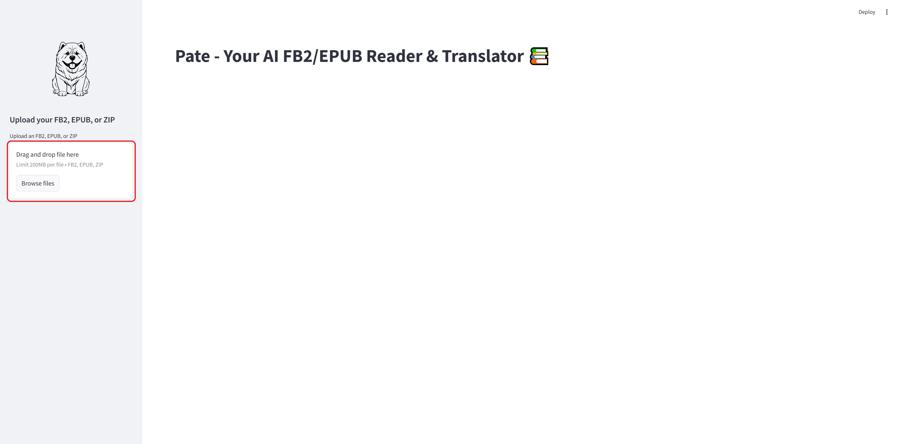
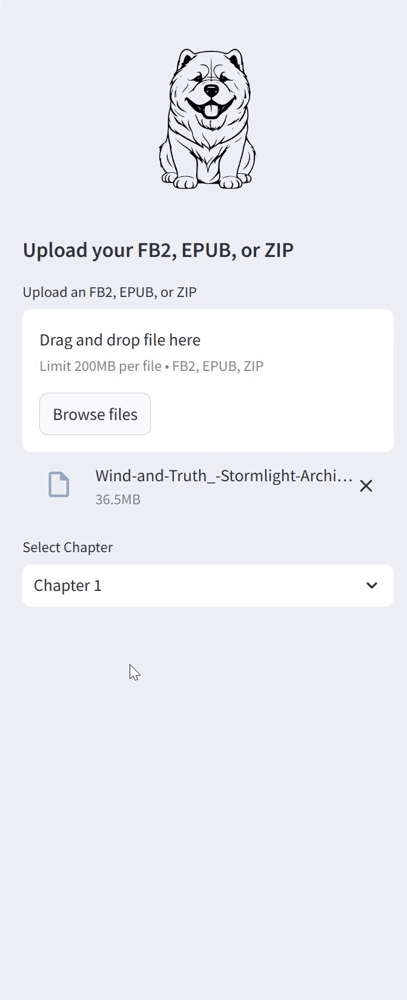

<div align="center">
  <picture>
    <source media="(prefers-color-scheme: dark)" srcset="images/pate_icon_light.svg" width="150" height="150">
    <source media="(prefers-color-scheme: light)" srcset="images/pate_icon.svg" width="150" height="150">
    
  </picture>
  <h1>Pate - AI FB2/EPUB Reader & Translator 📚</h1>
</div>

## Overview

Pate is an intelligent reader application that allows you to read FB2 and EPUB books while providing real-time AI-powered translation capabilities. Perfect for language learners and readers who want to enjoy books in their original language while having instant access to translations.

## Features

- 📖 Support for FB2 and EPUB formats.
- 🗜️ Handles zipped FB2 files.
- 🤖 AI-powered translation using Ollama.
- 📱  Responsive side-by-side view of original and translated text.
- 🌓 Dark/Light theme support.
- 📑 Chapter navigation.

## Installation

1. Clone the repository:
    ```bash
   git clone https://github.com/yourusername/pate.git
   cd pate
    ```
2. Install the required dependencies:
    ```bash
    pip install -r requirements.txt
    ```
3. Install Ollama from [ollama.ai](https://ollama.ai) and pull the required model:
    ```bash
   ollama pull aya-expanse:32b-q4_K_M
    ```

## Usage

1. Make sure Ollama is served:
    ```bash
    ollama serve
    ```
2. Start the application:
    ```bash
   make run # or you can use this from project root folder: PYTHONPATH=$(PWD) python -m streamlit run src/app.py
    ```
3. Open your browser and navigate to `http://localhost:8501`

## How to Use

### Loading a Book
<div align="center">
  
</div>

1. Click the "Upload an FB2, EPUB, or ZIP" button in the sidebar.
2. Select your book file (supported formats: .fb2, .epub, .zip).
3. Wait for the file to process.

You can also use 'drag&drop' feature to load your book.
### Navigating Chapters
<div align="center">
  
</div>

1. Use the chapter dropdown in the sidebar to select your desired chapter.
2. The content will automatically update with the original text and translation.

### Reading with Translation
<div align="center">
  
</div>

- Original text appears on the left.
- AI-translated text appears on the right.
- Translations are generated in real-time as you navigate through the content.

## Configuration

You can modify the translation settings in `src/app_config.py`:
```Python
OLLAMA_MODEL = "aya-expanse:32b-q4_K_M" # Change the AI model
TRANSLATION_LANGUAGE = "Russian" # Change target language
TRANSLATION_PROMPT = "Translate this text to {language}, don't say anything else: {text} \n{language}:" #Change prompt
```

The main translation logic is stored in `src/utils/llm_translator`. You can modify this file if necessary (e.g. use OpenAI API for translation).

## Requirements

- Python 3.8+
- Streamlit 1.39.0
- ebooklib 0.18
- beautifulsoup4 4.12.3
- Ollama 0.4.2+

Also, you need a machine that can handle Ollama running your selected LLM. In my case, it was a PC with an RTX 3090.
## Contributing

Contributions are welcome! Please feel free to submit a Pull Request.

## 🗓️ Backlog

#### External LLM Integration
- [ ] Support for OpenAI API integration
- [ ] Add Claude/Anthropic API support
- [ ] Configurable provider selection
- [ ] API key management interface
- [ ] Fallback options between providers

#### Translation Management
- [ ] Save translations back to FB2/EPUB files
- [ ] Export bilingual versions of books
- [ ] Cache translations for faster loading
- [ ] Batch translation of multiple chapters
- [ ] Translation memory system

#### Translator's Toolkit
- [ ] Interactive translation editing
- [ ] Translation quality verification
- [ ] Glossary management for consistent translations
- [ ] Comments and annotations support
- [ ] Translation style guidelines enforcement
- [ ] Version control for edited translations

#### User Experience
- [ ] Customizable side-by-side view
- [ ] Reading progress tracking
- [ ] Bookmarks and notes
- [ ] Translation quality rating system
- [ ] User preferences persistence
---